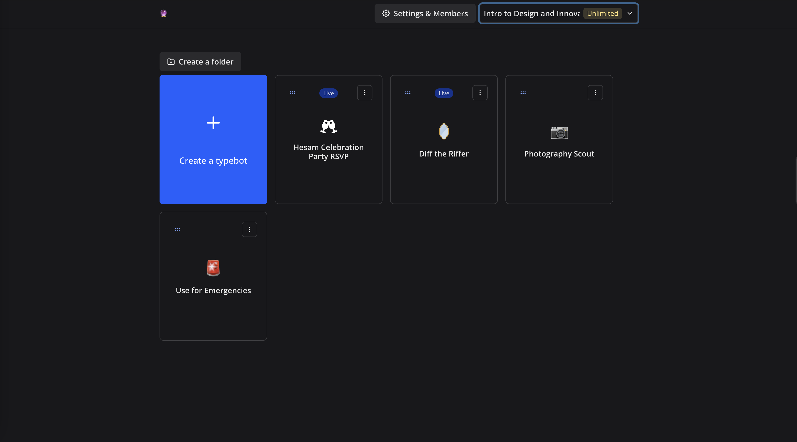

## 0. Getting Started

First, open your browser of choice and head to [Lilie's Typebot site](https://typebot.lilie.link/signin) to sign up for an account. Click "Sign up for free," "Continue with Google," and sign in with your NetID. 

**Make sure that you are not on the standard typebot.io site, and instead the Lilie typebot site. You can verify this by checking that the URL in your address bar contains [lilie.link](typebot.lilie.link)**.

After signing in, you should see a screen like **this**:

This is your **home screen**, where you'll see all the typebots you've created. You should see an empty page with only a "Create a typebot" button. Also, ensure that you're in the workspace that you've been assigned to (you can select a workspace by clicking the drop-down on the top right, highlighted in blue in the screenshot above).

*If there were any problems with signing in, selecting a workspace, or anything else, feel free to contact me at michelg@rice.edu or come to office hours!*

---

Ready to start building? [Let's build our first bot!](1%20-%20Hello%2C%20Typebot!)
