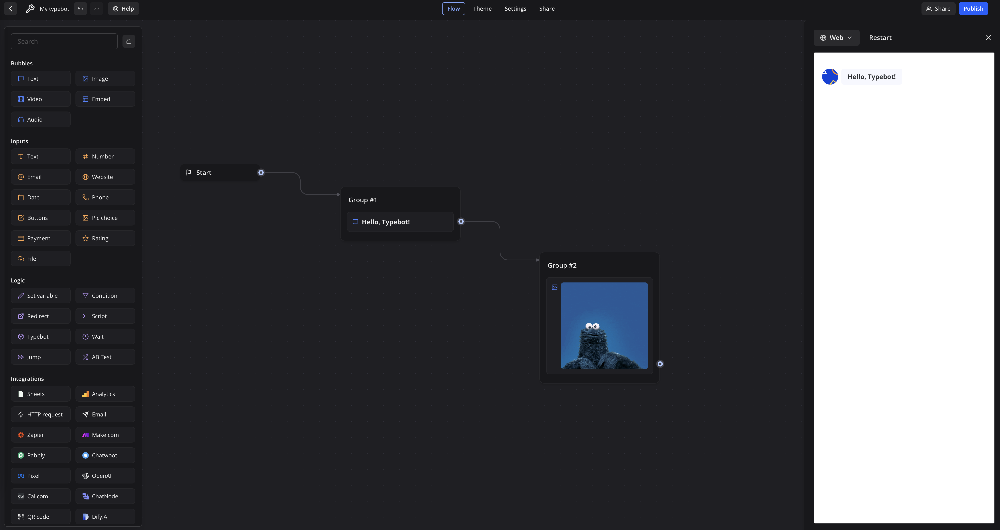

## 1. Hello, Typebot!

Now that you've signed into Typebot, let's begin by creating our very first Typebot – a simple bot that just says "Hello, Typebot!"

First, ensure that you are on the home screen and that you're in the right workspace. 

Then, create a new Typebot by clicking the "Create a typebot" button. Then, you should be greeted with this screen:

Select "Start from scratch." You should now find yourself in the **flow editor**:

*Aside: throughout this workshop, don't worry about saving! The great thing about Typebot is that your changes are always **autosaved**. Just make sure that you have a reliable Internet connection!*

---

See the column of blocks on the left? That's the **Sidebar**, and it contains a library of various *blocks* that you can string together to compose your Typebot.

We'll start with the blocks in the **Bubbles** section in the Sidebar. Those blocks all make your bot **say something**. We'll be using the Text and Image blocks, but the rest should be pretty similar (aside from the Embed block, which is more complex but allows you to put a website *inside* of your Typebot), and you should feel free to explore these blocks yourself, with the help of Typebot's [official documentation](https://docs.typebot.io/get-started/introduction)!

Let's add a Text block in the middle of the flow editor! To do this, click and drag the Text bubble into the flow editor. You should see something like this:

Within this highlighted text box is a message that your bot will say. Let's type in "Hello, Typebot!" (or if you want to be creative, anything at all! Feel free to take creative liberties throughout this workshop).

You'll also notice that you have controls for styling your text (ignore the leftmost person icon for now. That'll come in handy later!). Feel free to play around with them!

You should end up with a flow like this (I've chosen to bold-en my "Hello, Typebot!" text):

Now, let's try to **run** our Typebot! Click on the "Test" button on the top right of the screen. You'll notice that a sidebar appears, but there's nothing in it.

This is expected! Notice the "Start" block in the flow editor that's been there (those of you who remember using Scratch can view this as a "When green flag clicked" block)? That is the **start of your flow**. 

Think of "Start" as a mountaintop where a flow of water is going to go down; you'll control this "water" by "piping" it to various blocks. As the "water" flows, it'll activate each block it flows through. For example, when this "water" flows through the Text block, the bot says whatever is in the block!

---

Now, let's pipe the flow from the Start block to the Text block. Click on the little circular handle at the right edge of the Start block, and drag it onto the Text block.

*The keen-eyed among you may notice that you can either drag the flow to the text block itself or the enclosing group. Whichever one you drag it to doesn't matter in this case (I've personally dragged it onto the group, as you can see below). However, it **will** make a difference should you choose to put multiple blocks into a single group.*

*Putting multiple blocks in a single group doesn't enable any extra functionality, but will make your flow cleaner. I will not be using groups in this document, as I want to focus on only the basics that will allow you to create the functionality you want, but feel free to use groups for organization if you think they will help more than they hinder!* 

Your flow should now look something like this:

Now, let's test the bot again. We can do this by clicking on the "Restart" button on the testing sidebar on the right (highlighted in red below):

You should see that the bot will now say "**Hello, Typebot!**" (or whatever you've put in). Now, let's try spicing it up by adding an **image** ✨!

---

To make the bot do anything, we need to add a block from the Sidebar. Since we're trying to make our bot **say something**, we should look at the **Bubbles** section of the Sidebar.

And since we're trying to make the bot "say" (display?) an image, let's drag and drop an Image block from the sidebar into the flow editor, like so:

---

> ⚠️  **Be careful not to accidentally *group* blocks!**
>
> When dragging and dropping a block into the flow editor, be careful not to **drop it onto another block**, or they may group together. If you accidentally group two blocks together, you can ungroup them by dragging the block out of the group. 
>
> You might find that your flow works, even when blocks are grouped together. Groups are an organizational feature in Typebot that lets you better structure your flow blocks; blocks that are grouped together are **implicitly connected in flow** (as if there's a grey arrow connecting each item in a group to the next item in a group).
>
> I won't go over grouping because it's somewhat confusing and doesn't enable any new functionality, but if you want to use the organizational benefits of groups, feel free to use them! I'm not discouraging their use; I'm warning against accidentally using the feature.

---

As you can see, we have five options for images:

1. Link: adding a URL for an image
2. Upload: uploading your own image.
3. Giphy: using a GIF from Giphy
4. Unsplash: using a stock image from Unsplash
5. Icon: using one of Typebot's built-in icons

Since I'm looking for a celebratory "Hello!" GIF: I will select "Giphy" and search for an image to add. You can feel free to use any image you wish.

Now, like before, we need to **connect the image block with the flow** to make the bot actually display the image. Now, since we want the image displayed **after** the "Hello, Typebot!" text, we should **drag and drop the circular handle on the right side of the "Hello, Typebot!" block to the image block**, like so:

---

> ⚠️  **Remember to keep the blocks flowing!**
>
> When adding a block to the flow editor, remember that, **unless it is connected to by another block, it will not do anything.** If you find yourself frequently forgetting to connect blocks, try connecting a block **directly after adding it to the flow editor** and before adding any properties.

---

Now that we've finished the flow, once again tap on "Restart" to re-run your bot, and you should see your bot output an image:

---

Now, let's move on to the final finishing touches, which will allow you to share your bot with everyone else! 

First, let's rename your bot to something more interesting. Click on the "My typebot" name in the top left corner and type something to edit the name. For example, I renamed mine to "Hello Typebot":

You can also add a custom icon to your typebot (as I have!). Similarly, click on the icon for the bot to edit the icon.

Lastly, let's publish 🚀 the bot to the world! Click on the blue **Publish** button on the top right (highlighted in red below):

After publishing, you should see a screen like this:

where you can see a link to your Typebot. Feel free to copy the link, try it out, and share it with friends! That's the end of the first bot!

---

If you're interested, you can see my final bot [here](https://bot.lilie.link/hello-typebot-mxjhqik)!

---

### Help / Tips

Remember, if you find yourself needing help, feel free to contact me at michelg@rice.edu or come to office hours!

---

### What You've Learned

Pat yourself on the back because, by building this one bot, you've learned quite a bit! You've mastered how to:

1. Navigate Typebot's interface
2. Make your Typebot say something
3. Make your Typebot display an image
4. String it all together and make things flow
5. Publish your Typebot to the world!

---

### Bonus Activities

*Try these for an extra challenge!*

1. If you followed my flow exactly, try changing it up! Have your bot say something different than "**Hello, Typebot!**". Maybe make something italicized. Bold a word. Change up the picture. Upload your own photo. The possibilities are endless!
2. Use your knowledge of flow to **flip the order**. That is, make the bot display the image **and then** say "**Hello, Typebot!**"
3. Currently, the group names are just "Group #1" and "Group #2". Try editing them to make them more descriptive so that someone can understand your flow better!
4. Try making your bot say more than just two things. Maybe make it say three things. Or four!
5. Explore the editor! Look at the theme editor, the settings page, try dragging random blocks into the flow editor to see what they do, etc..

---

Ready for our next bot? [Next up: What's Your Name?](2%20-%20What's%20Your%20Name%3F)

 

 

---