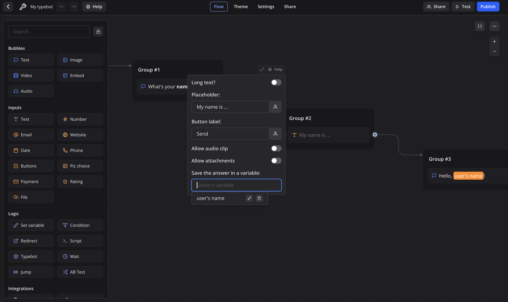
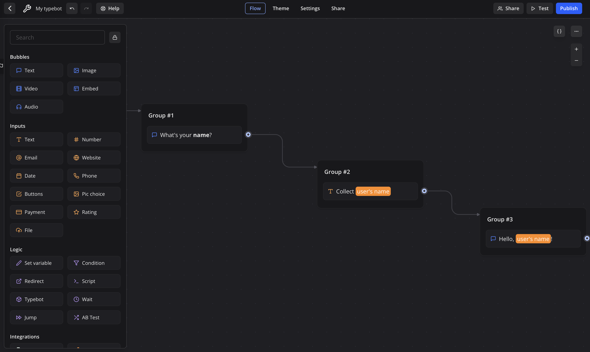

## 2. What's Your Name?

Our first Typebot greeted us quite merrily with a message and even an image, but it wasn't very smart. It never asked us anything, and every time we re-play the bot, it did and said the **exact same thing**.

We'll be changing that up with a bot that asks for your name and greets you with the name that you provided using the power of *variables* (which you might recognize from programming and lightly from math. Don't worry! No cryptic code here!). [Here's a preview of the final bot we'll have by the end of this section](https://bot.lilie.link/what-s-your-name-oz4ezh8). Feel free to try it out before continnuing reading!

---

Once again, let's start by [navigating to the home screen](https://typebot.lilie.link/typebots). If you're coming directly from building the previous bot, you can simply click the back button at the top left of the interface (don't worry, your Typebots autosave, given that you have a reliable Internet connection).

Now that we're back at the home screen, let's create a new Typebot by clicking the "Create a typebot" button and then selecting "Start from scratch". You should once again find yourself in the familiar flow editor with an entirely empty flow.

---

Let's start by having the bot ask "What's your name?". As you may recall, to make the bot say something, we should turn to **the Bubbles section** of the Sidebar. 

And as we're trying to make it speak text, let's drag and drop a Text block into the flow editor and fill it in with the "What's your **name**?" text that we want it to say (I've decided to bold **name**, and you may style your text or even change up the text as you see fit!). Additionally, remember: to make this block actually work, remember that we need to **connect this block to the Start block** by clicking and dragging on the circular handle on the right edge:

Let's test our bot by clicking the "Test" button on the top right. You should see your bot say "What's your **name**?":

---

Now, we need to have you be able to **reply** to the bot. Like how the blocks in the **Bubbles** section of the Sidebar make your bot say something, the blocks in the **Inputs** section of the Sidebar prompt **you** to say something.

Since we want you to reply back with a text message, let's **drag and drop a Text block onto the editor**.

Like the Bubbles Text block, you can see that you have a lot of options for customizing the text block. Let's change the placeholder text from the generic "Type your answer…" to something like "My name is …" (feel free to change it up as you see fit!):

and let's connect the Bubble Text block to the Inputs Text block:

Now, let's re-test our bot by pressing the Restart button:

And you'll see that we can now reply back to our bot! Once we reply to it, we'll see that nothing happens. This is to be expected, since the Input Text block doesn't connect to any other block.

---

We'll fix that by making the bot reply back! Remember that, to make the bot say something, we need to drag and drop a **Bubbles Text** block into the editor:

Here, we'll encounter a problem: if we made the bot say "Hello, Michel!", the bot wouldn't work if your name was, say, Hesam. Here, we're encountering a situation where **the bot needs to "remember" and act differently based on on prior inputs**. This is where **variables** come in useful.

For now, we can understand variables like placeholders in Mad Libs. That is, something like "Hello, \_\_\_\_\_\_ (`user's name`)," where the bot fills in `user's name` with the actual user's name.

`user's name` is an example of a **variable**. Like variables in math, variables are **abstract references to an actual value**. For example, in mathematics, `x` isn't 5 — it can be 5. But it can also be 7. However, unlike variables in math, where the value of `x` is hopelessly bound by a provided set of equations, in Typebot, **you** get to set the value of `x`. For example, you can assign `x` to something said by the user, and then have the bot say `x` later.

*Note that variables in Typebot, unlike variables in math, change with time. This means that a variable like `x` can be first set to "Design" and then changed to "Innovation". If you used `x` after it was set to "Design" but before it was set to "Innovation", it would have the value "Design". And if you used `x` after it was set to "Innovation", the value "Design" would be entirely **overwritten and replaced** with "Innovation".*

---

Let's make that abstract discussion more concrete. Let's start by finally filling in that text box. Let's start with "Hello, ":

Now, we need to add the variable **user's name**. Let's click the Person icon (highlighted with red below) to bring up the **variables menu**:

You should see a prompt to have you search for a variable. Let's type in "user's name":

This should surface no variables, as we haven't created any yet. However, it does prompt us to create a new variable called `user's name`. Let's do that:

You'll notice that Typebot has filled in "{{user's name}}" into the text. *Remember our previous Mad Libs example?* This is basically instructing the bot to replace "{{user's name}}" with the value of the variable `user's name`.

Now, let's finish off the text block by adding an exclamation mark to the end and **connecting the previous Inputs Text block with our new Bubbles Text block**:

Let's try out our new flow! Let's click Test (or Restart, if you already have the Testing sidebar open), enter our name, and…

it simply says "Hello, !". It's blank! What gives?

The problem is that we've **never stored the user's input into the variable**. Remember that Typebots are **not artifically intelligent**. They follow exactly and do **no more and no less** the blocks that you instruct it to do. It won't notice that your variable name is called `user's name` and fill in the variable for you as the user enters their name (in fact, you could've named `user's name` anything).

So, let's have the Inputs Text block assign the input to the variable `user's name`! To do so, click on the Inputs Text block:

As you might've guessed, we should click on the "Select a variable" box underneath "Save the answer in a variable":

and select `user's name`!

Now let's try running it again:

It works! The bot asks for our name and then greets us, as intended! 

---

Now, let's add a hint of flair by **bolding** the name spoken and giving our Typebot a name and icon (I've chosen "What's your name?" with a person icon). 

I want you all to give Typebot a try for yourselves, so I won't give detailed step-by-step instructions! But here's a couple hints if you're stuck:

1. Remember how we **bolded** standard text? What if we tried doing the same thing with the meta-text referencing the variable instead?
2. The steps to changing the name of the Typebot and the icon are exactly the same and already detailed in the previous section, but let's try to remember how it's done!

At the end, you should end up with a Typebot like [this one](https://bot.lilie.link/what-s-your-name-oz4ezh8):

---

Lastly, as with every Typebot we make, we should **publish it to the world!** Let's click the blue **Publish** button on the top right:

and we're published! Feel free to play with your bot, send it to your friends, or anything else! Congratulations on finishing the second exercise!

---

If you're interested, you can see my final bot [here](https://bot.lilie.link/what-s-your-name-oz4ezh8)!

---

### Frequently Asked Questions

**Does a variable's name matter?**

No! As I've touched on previously, a variable's name does not have to coincide with what's inside of it at all. You could've named the `user's name` variable `meow` and it would have worked nonetheless.

**If that's the case, why did we have to name it `user's name`?**

We didn't! However, using variable names that **clearly describe what's inside** allows you and others to clearly understand your flow.

**Does setting a variable for one run of the bot affect other runs, even runs going on at the same time, at all?**

Absolutely not! Variables are **entirely localized to each run** and have **no impact whatsoever on any run, at any time, on any computer**.

---

### Help / Tips

Remember, if you find yourself needing help, feel free to contact me at michelg@rice.edu or come to office hours!

---

### What You've Learned

That was quite a lengthy section, so congratulations on making it through! You've learned in this section to:

1. have your bot prompt a reply
2. think about the concept of a *variable*
3. apply the concept to personalize the bot and have it say your name!

---

### Bonus Activities

*Try these for an extra challenge!*

1. Let's try having the bot ask for more things than just your name! Have it ask your age, your residential college, or anything else!
2. Use your knowledge from the previous exercise to add some interesting touches! This can be an image, more text blocks, or anything else!

---

Ready to continue? [Let's get buzzed with the Liu Idea Bar!](3%20-%20The%20Liu%20Idea%20Bar)

