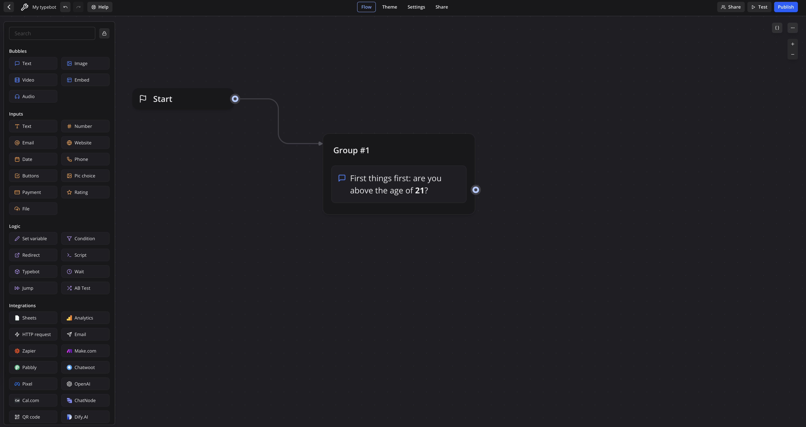
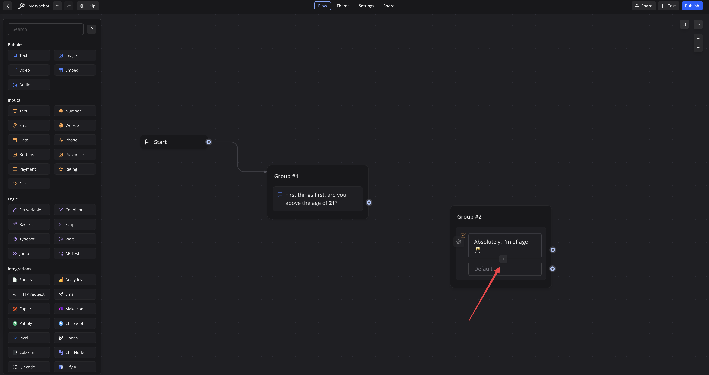
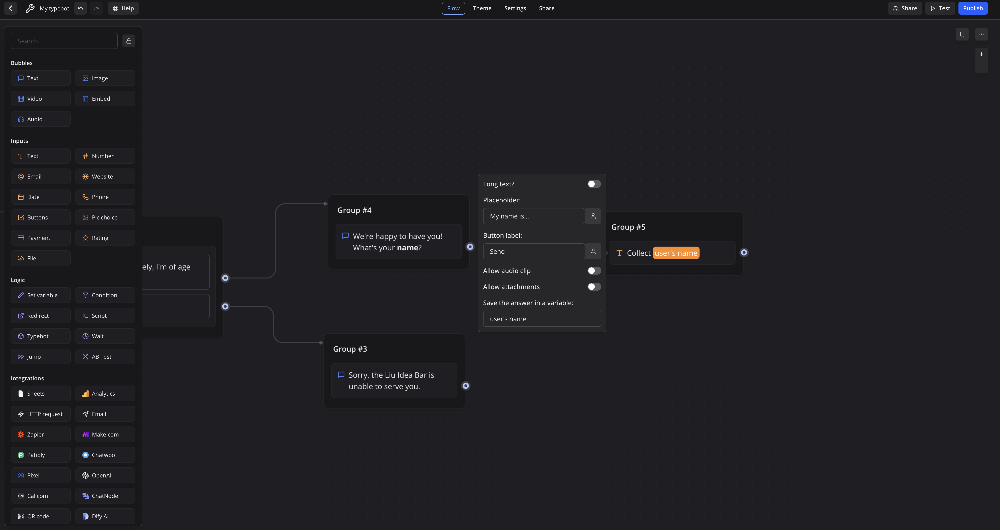
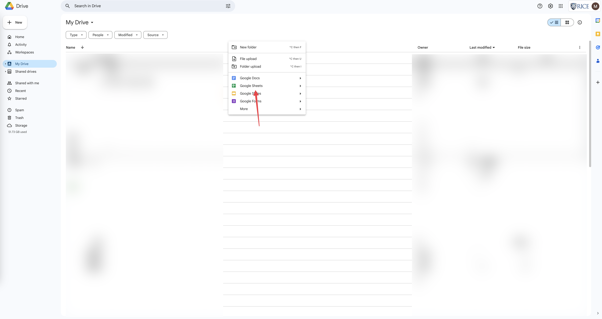
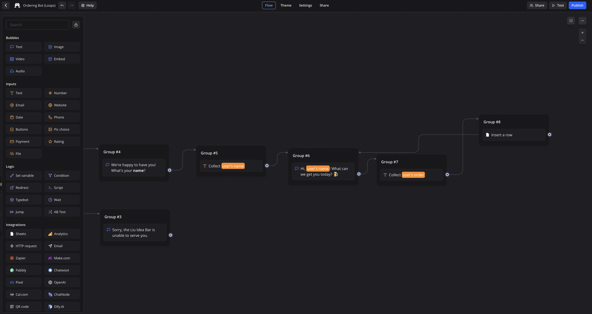

## 3. The Liu Idea Bar

Now that you know how to make your bots say things and even ask for and store messages from the user, let's try for something more complex: a bot that remotely takes orders for Hesam and I's secret new joint venture: The *Liu Idea Bar*. For a preview of the bot, [see here!](https://bot.lilie.link/ordering-bot-kxlpqvw)

---

### What the Bot Will Do

Since our ordering bot will be more complex than the previous ones, I'll first detail exactly what our bot will do:

1. The bot will ask the user if they're above the age of 21
2. If not, the bot will simply decline to service the user (we unfortunately must still operate under regulation!)
3. Once the user has confirmed their age, the bot will ask the user for their name
4. The bot will then ask the user what they want to order
5. Lastly, the bot will add this information to a Google Sheets document

---

Now that we know what the bot needs to do, let's start!

Once again, let's start by creating a new bot! As a reminder, we create a new bot by returning to the home screen, clicking "Create a typebot," and then selecting "Start from scratch."

Now that we're back in the flow editor, let's start with the first thing the bot will do: ask the user if they're above the age of 21. As you may recall, to make the bot say something, we should turn to the Bubbles side of the Sidebar and add **Text** into the flow editor, connect it with the Start block, and type in the text:

---

Now, the user must respond with a "Yes" or a "No". We *could* use a Inputs Text block for that, but since we only want the user choosing between a small number of options instead of having the user provide freeform text input, we can use a Inputs block more suited for that instead – Buttons.

Buttons is suitable for when there's only a small amount (~2-5) of choices the user can choose. Buttons is **especially suitable** when you want the bot to take drastically different actions depending on what the user enters (we'll see why this is soon).

Let's drag the Inputs Buttons block into the flow editor:

You don't have to worry about all of those options for now (though you may recognize some, like "Save the answer in a variable", from other blocks). Let's edit the text to say "Absolutely, I'm of age 🥂" (you may set your own text as you see fit):

Now let's add a new option. We can do this by hovering over the bottom edge of the "Absolutely, I'm of age 🥂" text box and clicking the "+" button (highlighted with red below):

Now let's fill in the new option with "No :/" (you can choose your own text) and connect the Buttons block with the previous Bubbles Text block:

And now we're finished with the Buttons block! Let's try it out by clicking on the Test button on the top right:

And you should see that the bot presents you with the two choices we've typed in! Selecting any of the two choices shouldn't do anything for now, but we'll fix that right away:

---

You might notice that, unlike other blocks, there are **three** circular flow handles on the right edge of the Buttons block compared to just one on other blocks. This allows you to **easily divert the flow** based on the user's choice. Here, we'll use this capability to reject the user if they're not of age and continue with the rest of the flow if they are.

Let's first handle the situation where the user is not of age, as that's simpler. We simply have to tell the user that we're unable to serve them and end the bot (which we can do by not connecting a block to anything).

Since we want to have the bot say something, let's add a Bubbles Text block and type in something like "Sorry, the Liu Idea Bar is unable to serve you.":

Now, let's connect the "No :/" selection to this Bubbles Text block:

And since this Bubbles Text block isn't connected to anything, the bot should stop as we intended. Let's test it!

It works precisely as intended, replying with a polite rejection followed by ending the bot!

---

> ❓ **What's the "Default" selection?**
>
> As you might've noticed, the Default selection in the Buttons block is not editable, but still has a flow handle. What is this Default for? 
>
> The Default selection is **not** selectable by the user and only serves as an **aid for you to make flows easier**. Essentially, any choice that is not explicitly flowed to anything will implicitly use the flow of the Default. 
>
> So, if you have two selections (like we do above) and you connect the first one to a Bubbles Text block, connect the Default to an Inputs Text block, but connect the second selection to nothing, choosing the second selection will lead to the Inputs Text block being flowed to next. 
>
> If nothing is connected to the Default and nothing is connected to the choice, selecting the choice will simply end your bot.
>
> Feel free to try out the Default selection! We won't be using it here, but it may come in useful for your bots!

---

Now, let's move on to what the bot should do if the user *is* of age. Our planned flow from earlier notes that the bot should first ask the user for their name. That's almost exactly what we did in the previous section!

Recalling the previous section, we should:

1. Use the Bubbles Text block to have the bot ask for the user's name
2. Use the Inputs Text block to collect the user's name and store it into a variable (like `user's name`) so we can actually use it later on

Okay! Let's start with the Bubbles Text block and connecting it to the first Buttons selection:

---

Now let's draw upon what we've learned in the previous section and add a Inputs Text block to collect the user's name, noting to save it in a variable (this time, feel free to name the variable whatever name you please!):

Remember to connect the Bubbles Text block to the Inputs Text block for the Inputs Text block to actually work:

Let's test it!

You should see that the bot should ask and prompt for your name once you've selected that you're of age!

---

> 💡 **Tip: Reorganize your flow!**
>
> At this point, you should have quite a bit of blocks in your flow editor. Feel free to reorganize them by dragging them around in whatever way you see fit! If you're comfortable with groups, now is the time to start grouping things together!
>
> Reorganizing your flow is the equivalent of keeping your desk tidy: it might not make you immediately more productive but is ultimately helpful in the long run by helping you keep track of where things are.

---

Now, let's move on to the next part: asking the user for their order.

---

💪 **Challenge: Do it yourself**

Before continuing reading, let's pause and think. You already know everything you need to know to have the bot ask for an order.

Consider: what does the bot need to do to ask the user for their order? Is this any different than asking the user and remembering their name?

When building a Typebot, keep in mind what we've been doing so far:

- Breaking the task down into atomic parts
- Mapping what the bot needs to do to blocks
- Connecting the block
- **Test, test test!** Test every step of the way. Is your bot working? Did it suddenly stop working? What did you change?

Please do give this a shot before continuing; doing it yourself is extremely helpful in learning!

---

Once you're ready, 

scroll

beyond

this

point

to

continue!

---

Let's start by having the bot ask for what you want. Remember that, to do this, we need to add, fill in, and connect a Bubbles Text block:

Feel free to have the bot say whatever you'd like! You can see that I've made use of knowing the user's name to make the bot more personal and have the bot greet the user directly. 

Let's then collect the user's order with an Inputs Text block, remembering to connect it to the rest of the flow and store the response in an appropriately-named variable:

Now, being the good Typebot developers we are, let's test it:

and it works! We're able to:

1. Confirm our age (or pretend to)
2. Provide our name
3. Give our order

There's only one remaining thing to do…

---

***Integrations!*** Up till now, your bots have been unable to take any action. The bot couldn't actually place an order on your behalf, write something into a Google Sheet, send an email, etc.. Integrations allow you to do all of that, and more! (Such as adding AI into your bot to make it capable of answering more freeform questions)

Here, we'll make use of a relatively simple but powerful extension: Google Sheets! The Google Sheets extension lets you, as you might guess, have your bot add or change data on a Google Sheet.

Let's start by scrolling down to the "Integrations" section in the sidebar and dragging and dropping a Sheets block into the flow editor:

We first need to select a Google account to add the sheet to. Click on "Select Sheets account" and select "Connect new" (*I already have Sheets accounts connected, but you should see a drop-down with just "Connect new"*):

Typebot will prompt you to connect a Google account:

Click on Continue with Google and connect your Rice account. You should be redirected back to Typebot and see your Rice account selected:

Before continuing, we must create a new spreadsheet first. Let's open a new tab, head to [Google Drive](drive.google.com), sign into our Rice account, and enter "My Drive".

Right click on the top bar and select "Google Sheets":

Let's name this sheet "Liu Idea Bar Orders" and add two column titles: "Name" and "Order":

Now that we've set up our sheet, let's return to Typebot, select "Pick a spreadsheet", select our new "Liu Idea Bar Order" sheet, and click "Select" to confirm:

Let's click on "Select the sheet" and select "Sheet1" (this may be different if you've changed the name of the sheet):

Typebot then prompts us to Select an operation. Since we want to add data into the sheet, let's select "Insert a row":

Select "Add a value":

then "Select a column":

Now, you should see the names of the columns that we've created previously. Every "Value" is a column-text **pair** that then gets put in a single row. For example, if we add two values – "Name", "Michel" and "Orders", "Hesam's Special" – we **wouldn't be adding two rows**. Rather, we would be adding **one row** with **two columns** filled. Any columns that we do not specify here will be left blank.

Let's populate the Name column first. Select Name, and we're now prompted to type a value. Remember that the user's name is a value that we collected directly from the user and put into the variable `user's name`. And since we're trying to access a value stored in a variable, we should select the Person icon:

and select the variable "user's name". Before adding the user's order, let's test the bot! **Remember to connect the previous Inputs Text block to the new Sheets block**, and let's click the "Test" button and test the bot:

You should see Typebot inform us that a new row has been successfully inserted! Let's open our Google Sheet and check:

You should see a new row added to your sheet, with the name entered but a blank order (since we didn't add a Value for Orders yet). That means that your bot has successfully integrated with Google Sheets!

---

Now for the final stretch: let's add an Orders value! Let's return to Typebot, select the Sheets block, select "Add a value", and select "Orders" in the "Select a column" drop-down.

Now we need to enter the value to be stored as the order. Remember that we collected the order from the user and stored it in the `user's order` variable. To access the value stored in the variable, let's similarly select the Person icon to bring up our variables and select `user's order`:

and that should be everything! Let's test the bot again and verify that a row has successfully been inserted into our Google Sheets:

To further verify, let's check our Google Sheets:

and we should see a new row with **both the correct name and the correct order**!

---

Lastly, as we should do for every Typebot, is to give it a nice name and icon and publish it to the world! Give your bot a new name using the toolbar, and hit Publish!

---

### Help / Tips

Remember, if you find yourself needing help, feel free to contact me at michelg@rice.edu or come to office hours!

---

### What You've Learned

Congratulations on finishing quite a long workshop! Over the course of this workshop, you've learned:

- What Typebot is
- What Typebot can do
- How to make your Typebot say something
- How to have your Typebot display an image of your choice
- How to have your Typebot accept user input
- The concept of a *variable*
- How to have your Typebot do different things based on user input with variables
- How to have your Typebot respond to user choice
- How to interface your Typebot with Google Sheets

And of course, there's still a lot of other things that you can do with Typebot! Feel free to explore these using the [**official Typebot docs**](https://docs.typebot.io/get-started/introduction) or reading on to the bonus section!

---

### Bonus Section: Another! 🍻

*Try this to learn about how to make loops in your bots! You won't be needing this for the **RSVP Bot Project**, but loops open up a whole new set of possibilities for your bots!*

Back to our Liu Idea Bar: it wouldn't be a particularly interesting bar if you could only order one drink, wouldn't it? We'd be using the power of **loops** to let you place an order for **multiple drinks using the bot!**

Loops play off of a very simple but extremely powerful idea. Remember the flow arrow? We've always dragged it onto a new block we've just added. But, what happens if we dragged the arrow to point to an *existing* block?

Let's try that! Let's drag the flow handle on the Sheets block and drop it onto the "We're happy to have you!" block:

Let's give it a shot by clicking the **Test** button! You should see that, after your bot takes an order… it goes back to asking you about your name! Let's continue until we place two orders:

and let's check our Google Sheet:

You might notice a few things:

1. Connecting the flow arrow backwards onto a block, quite intuitively, just brings you back to said block. It doesn't bring you back to the start, it doesn't even show that it looped in the bot itself. It just loops back.
2. Variables still work perfectly fine! As you can see in the Google Sheet, my second entry of "Kyle's Hot Mix" added into the Google Sheet! And this is to be expected – when you set a variable a second time, it **completely overwrites** the previous value. And when the variable is read again, it'll read this new value!

---

Now, for our "place multiple orders" bot, this is close but not exactly what we want. For one, our name (shouldn't) change between orders, but we currently have to write our name over and over again. Looking at our flow:

- The red blocks handle taking the user's name (by first asking for the name and then collecting it)
- The orange blocks handle collecting the user's order (by similarly asking for the order and then collecting it)
- The green block adds it to a Google Sheet

Okay. We **don't want** the name collecting but we definitely do want to still collect the user's order and add it to a Google Sheet. 

So we want the orange and green parts to loop. Since connecting the flow arrow to a block leads to that exact block and every block onwards being run, we should connect it to the **first block in the orange group**. In other words, the Sheets block should connect to the Bubbles Text block asking about the user's order:

Let's test it! You should see that the bot *does* work as intended – but it's a bit… overzealous. It will ask you for an order. Over, and over, and over again. 

---

We can fix that by, after every order, asking the user whether they want more! If they do, we can continue. If they don't, we can thank them for their order.

Before we get any input from our user, we should prompt the user first with a Bubbles Text block (let's not do any flow just yet):

Pop quiz!~ What block do you use when you want to present th euser between a small number of choices that might significantly alter your bot's flow?

That's right – it's the Inputs Buttons block! Let's drag the Inputs Button block to the end of our flow and populate it with our "Yes" and "No" choices. 

Now let's zoom out and reason about our flow. 

We have:

1. The red blocks (the name collection)
2. The green blocks (the order collection)
3. The cyan block (the actual row insertion)
4. The purple block (the *more* prompting)
5. The pink block (the *more* choice)

We can see two "sub-flow"s:

1. red + green + cyan – the "standard" flow that we built up before repeats. These three should (and already do) connect back-to-back: red -> green -> cyan
2. purple + pink – the "do you want to go again" flow. They should similarly connect sequentially, purple -> pink.

Since we want to prompt the user on whether they want to go again right after the "standard" flow, we should connect the "standard" flow to the "do you want to go again" flow by connecting cyan with purple. 

Let's now consider how to connect the two flow handles on the Inputs Buttons block. If the user wants another one, we should direct them back into the standard flow; but not onto the red block, as then they'll have to say their name again. We should direct them onto the green block. And if the user's done drinking, we should end the bot – but not before thanking them for their order! 

Taking all that into account, our final flow should look like this:

Let's reason about it by following the arrows. Once the user confirms that they're of age, we:

1. Ask for and collect their name. This is indeed what we want.
2. Ask for and collect their order. This is also what we want.
3. Add that order to a Google Sheet. We need this to keep track.
4. Ask them if they want more. That's consistent with what we want
5. If they do, return to step 2. That seems right. They don't need to say their name again (that doesn't change), but we do want our bot to keep on collecting orders and adding them to the Google Sheet as long as the user wants more
6. If they don't, bid them farewell.

---

> ***Aside: Dry-run Testing***
>
> What we just did (reasoning through the behavior of our flow rather than actually running it) is known in the software engineering industry as *Dry-run Testing*. 
>
> So why would we do dry-run testing where we have to think instead of just… playing with the bot to see if it works? I personally do a quick dry-run test just to make sure that my flow does exactly what I expect it to do. It lets me catch issues early rather than purely (metaphorically) throwing things at the wall to see what sticks. I think it also helps in understanding exactly what your flow is doing. Feel free to use a mix of dry-run and actual testing, or just stick to pure testing!

---

That seems perfect! Let's test our bot:

It works exactly as intended! We get to keep ordering as long as we ask for another, it stops when we say we've had enough, and we don't have to enter our name over and over again!

---

Give yourself a **big** pat on the back, because you've just finished a ***bonus section*** where you've learned ✨ ***loops*** ✨! Loops are extremely powerful in Typebot, and they enable whole-new possibilities from the basics such as letting the user correct themselves to the extreme like recreating ChatGPT in Typebot!

You should have absolutely everything you need (and then some) to build all the bots you please! Have fun building some bots of your own, try the (extra) bonuses below, or start on the RSVP Bot Project!

If you want to learn even more about Typebot to do things like have it utilize the smarts of ChatGPT or have your Typebot send an email, feel free to consult the [**official Typebot docs**](https://docs.typebot.io/get-started/introduction).

---

### More Activities!

*Try these for an extra challenge!*

1. Currently, we have the user enter an order for themselves. For someone who's new to the Liu Idea Bar and doesn't know all of our offerings yet, they might find themselves confused. So, instead of having the user type in their order, have them choose from a list of choices!
2. (For those that did the Bonus section): If you were trying to order, say, 10 drinks, having to press "Another!" 10 times over gets quite annoying. Instead of having the user explicitly say "Yes" or "No" in addition to their order every time, get rid of the "Yes / No" choice altogether and have the bot stop when the user replies "I'm done" to the bot asking for their order. 
3. Up to now, naming has always been strange. Conversationally, when someone asks for your name, you wouldn't simply reply "Michel". You'd reply something like "My name is Michel". However, doing this to your Typebot will result it thinking that your name really is "My name is Michel". Use [ChatGPT integration](https://docs.typebot.io/editor/blocks/integrations/openai) and your provided OpenAI API key to fix this problem and make your bot more intelligent and conversational!

---

That's all for the Build-a-Bot workshop! If you're ready, you can start on the [RSVP Bot Project](Capstone%20Project)!

 

 

---