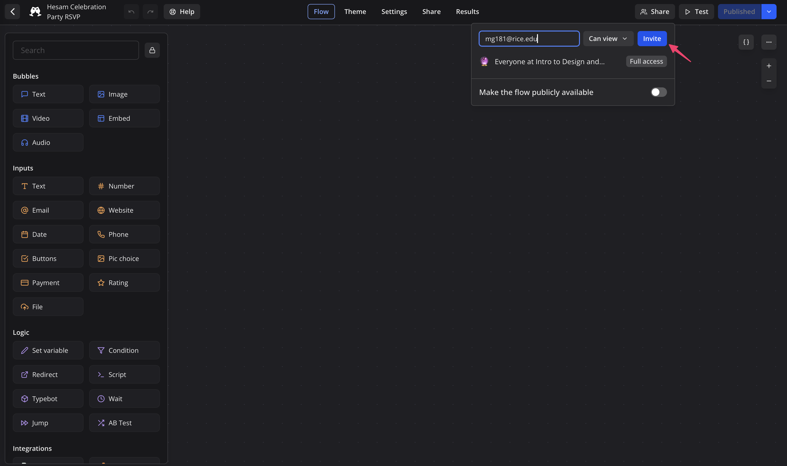

## The RSVP Bot Project: The Hesam Celebration Party

## 

Surprise! Lilie has decided to hold its annual *Hesam Celebration Party* to celebrate Hesam's birthday! And you, as a Typebot developer, have been tasked with creating the RSVP Bot for the party!

Your bot should:

1. Ask the user if they want to attend (accompanied with a GIF of your choice)
2. If so, ask for their:
   1. Net ID
   2. Name
   3. Email
   4. And add this information to a Google Sheet!
   5. And finally, thank them for RSVPing!
3. If not, thank them for considering and end the bot

Feel free to add your own flair to the bot! You can add more questions (such as dietary restrictions), add more images, or anything else you'd like! If you're interested in seeing an example of what the bot might look like, [see here!](https://bot.lilie.link/hesam-celebration-party-rsvp-l67r4b3).

Feel free to reference the workshop if you need help. Remember, you can always reach out to me at michelg@rice.edu.

---

### Submission

Once you've finished your Typebot, the first thing you do will be to **publish the bot**. But that's not what you share with me! For your submission, you should **invite me to your flow**. Think of it like unscrewing the panel covering up all the wiring of your bot. All you need to do is to click on Share on the toolbar:

enter my NetID email (mg181@rice.edu), and click "Invite"! Send me an email once you've invited me to your flow, and I'll let you know if I can see your submission. 

That's all you need to do! Happy Botting!

*Generative AI was used to assist in the ideation of this project. All writing and editing was done by humans. Terrible Hesam images made with Generative AI.*
 
 
 
 
 
 
--- 