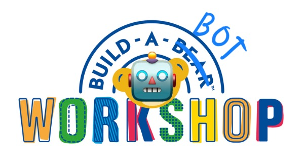

# Build-A-Bot!

Welcome to the ***Build-A-Bot*** workshop, where ***you*** can build a chatbot for *whatever purpose you want*! All you need is a computer, a stable Internet connection, and a drive to ***build***!

Throughout this workshop, you'll be building **four bots**, just like the ***Extreme Bot 1000*** you interacted with at the end of Tuesday. You'll build three by following along with me, and one final one by yourself! For a preview of the final bot you'd build, check [this link](https://bot.lilie.link/hesam-celebration-party-rsvp-l67r4b3).

This workshop is pretty long and should take you about an hour or two to complete. This is certainly too much for a single sitting, so take your time to take frequent breaks in between sections!. If you find yourself stuck at any point or if you have any questions, feel free to reach out to me through email at michelg@rice.edu, coming to office hours, or asking me directly in class.

---

Throughout this workshop, we'll be using **Typebot**. Typebot is a platform you can use to build… Typebots! Typebots are chatbots that are more like apps you talk to (think Extreme Bot 1000) than something more general-purpose like ChatGPT (though you *can* build ChatGPT with Typebot). 

Moreover, unlike ChatGPT, Typebots are not *artificially intelligent* (though they can be if you use ChatGPT or other AI services within your bot). This means that Typebots, unlike ChatGPT, can't follow instructions written in English. You must provide it precise, code-like instructions (though you will not be typing out any archaic code).

---

Ready to get started? [Let's go!](0%20-%20Getting%20Started)

---

Got lost? Here's a table of contents:

- Introduction (this page)
- [0. Getting Started](0%20-%20Getting%20Started)
- [1. Hello, Typebot!](1%20-%20Hello%2C%20Typebot!)
- [2. The RSVP Bot Project: The Hesam Celebration Party](Capstone%20Project)
- [3. What's Your Name?](2%20-%20What's%20Your%20Name%3F)
- [The RSVP Bot Project](Capstone%20Project)

